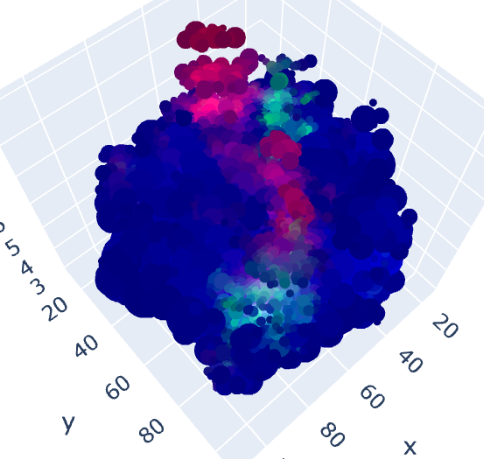

# thesis

### Repozytorium pracy pod tytułem:
**_Analiza porównawcza języków
Python i Julia w pozyskiwaniu danych
z wielowymiarowych obrazów tiff_**

**Autor:** Łukasz Michalik
  

**Opis:**

Obecnie wykorzystywane narzędzia do analizy wielowarstwowych plików `TIFF`,
takie jak na przykład `ImageJ` oraz `Fiji`, umożliwiają jedynie pojedyncze przeglądanie
serii obrazów uzyskanych na przykład z mikroskopu konfokalnego poprzez ustawienie
różnej ogniskowej mikroskopu. 

Celem projektu jest przygotowanie, odfiltrowanie oraz redukcja danych zawartych w wielowarstwowym pliku `TIFF`, tak aby możliwe było zaprezentowanie trójwymiarowego modelu danych na interaktywnym wykresie. Z danych zawartych w obrazach `TIFF` należy wytworzyć model, który da się przedstawić na punktowym wykresie 3D, tak aby można było nim manipulować, jednocześnie dane powinny zostać zredukowane w taki sposób, aby utracić jak najmniejszą ilość informacji zawartych w pliku.

W zakres projektu wchodzi także porównanie języków programowania `Python` i `Julia` pod względem poziomu trudności implementacji rozwiązań z zakresu pozyskiwania informacji z dużych zbiorów danych (do jakich należy zaliczyć wielowarstwowe pliki `TIFF`). Dodatkowo,
języki porównane zostały pod względem czasu wykonania kodu realizującego takie same zadania.
  

**Kod programu:**

`python_analiza_tiff.ipynb` <----- notebook w języku Python

`julia_analiza_tiff.ipynb`  <----- notebook w języku Julia
  

**Oryginalne obrazy:**

**Przykład wygenerowanego modelu 3D:**

